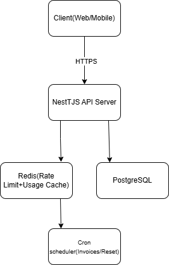

# 🚀 Multi-Tenant SaaS Backend

Production-grade SaaS backend built with NestJS, Prisma, Redis, and PostgreSQL.

## Features

- JWT Authentication & RBAC
- Multi-Tenant Isolation
- Subscription & Billing Simulation
- Usage-Based Limits
- Redis Rate Limiting
- Cron-based Invoice Generation
- Dockerized Infrastructure

## Tech Stack

- NestJS
- PostgreSQL
- Prisma ORM
- Redis
- Docker
- JWT

## Architecture



## Setup

```bash
docker-compose up -d
npm install
npx prisma migrate dev
npm run start:dev
